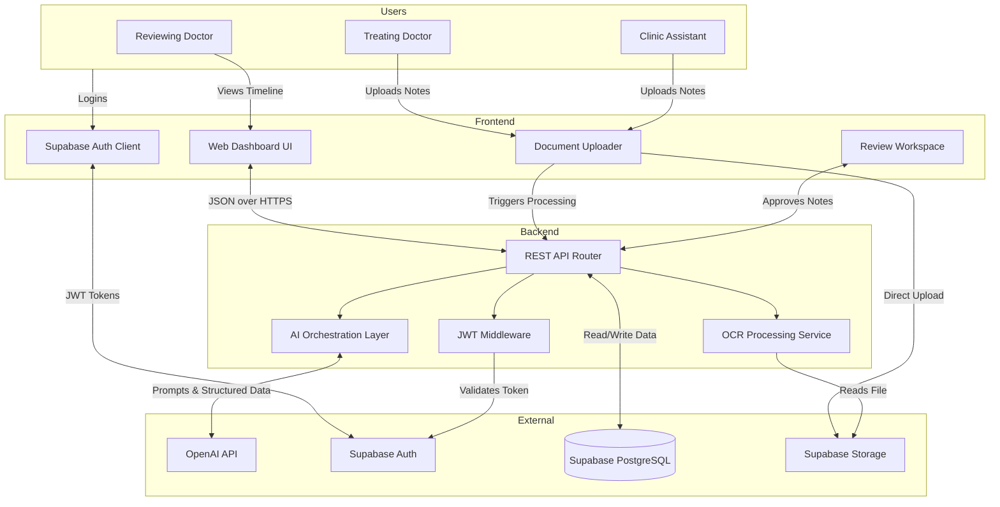

# System Architecture Diagram - ClinFlow

This document visualizes the data flow and hosting architecture for the ClinFlow platform.

### Flow Description:
1. **Authentication:** The clinic staff logs into the React frontend using Supabase Auth. The frontend receives a secure JWT token.
2. **File Upload:** A clinic assistant uploads a handwritten note. The file is saved directly to Supabase Storage, and the React app notifies the FastAPI backend.
3. **Processing:** The FastAPI backend (running on Firebase Cloud Functions) validates the user's JWT token, reads the image from storage, and runs it through the OCR service.
4. **AI Structuring:** The raw OCR text is sent to the OpenAI API with strict prompts to extract clinical data and flag missing information.
5. **Database Storage:** The structured data is saved to the Supabase PostgreSQL database as `pending_review`.
6. **Human Review:** A doctor opens the "Review Workspace" on the frontend, compares the AI output to the original image, makes edits, and approves the note, committing it permanently to the patient's timeline.
